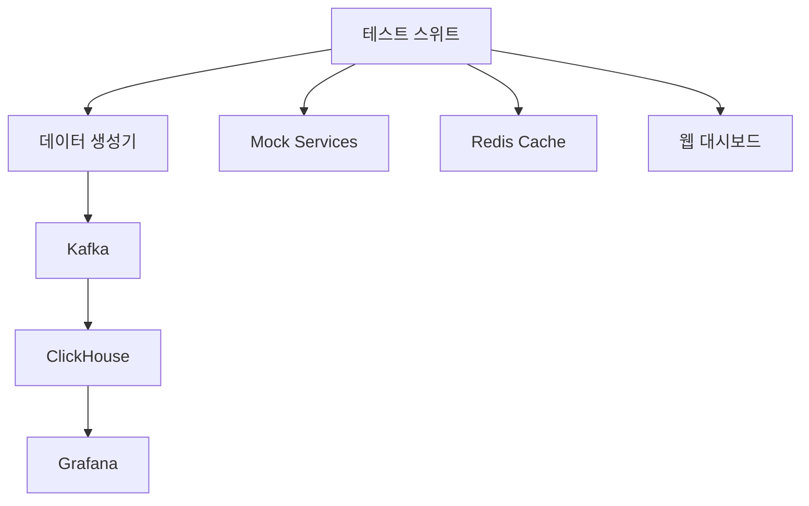

# AIRIS-MON 포괄적 테스트 스위트

**Korean HyperDX Style Complete Feature Demo**

AIRIS-MON 시스템의 모든 기능을 시연하고 테스트하기 위한 포괄적인 테스트 프로그램입니다.

## 🚀 주요 기능

### 테스트 시나리오 (7가지)
- **기본 모니터링**: ClickHouse, Kafka, Redis 연결 및 메트릭 수집
- **AIOps 이상 탐지**: ML 기반 패턴 탐지 및 예측 알고리즘
- **세션 리플레이**: 사용자 세션 녹화, 압축, 재생 기능
- **NLP 자연어 검색**: 한국어 토큰화, 의미 검색, 결과 순위
- **실시간 알림**: 임계값 모니터링 및 에스컬레이션
- **성능 부하 테스트**: 대용량 데이터 처리 및 시스템 한계
- **종단간 통합 테스트**: 전체 워크플로우 통합 시나리오

### 데이터 시뮬레이션
- **메트릭 생성기**: 시스템 성능 메트릭 (CPU, 메모리, 디스크, 네트워크)
- **이벤트 시뮬레이터**: 사용자 액션, 시스템 이벤트, 오류 상황
- **AI/ML 테스터**: 이상 탐지, 패턴 분석, 모델 정확도
- **알림 테스터**: 임계값 평가, 알림 생성, 전송 테스트
- **세션 리플레이**: 사용자 세션 시뮬레이션 및 품질 검증
- **NLP 검색**: 한국어 쿼리 처리 및 검색 정확도

### 실시간 대시보드
- **한국어 UI**: Korean HyperDX 스타일 인터페이스
- **실시간 차트**: CPU, 메모리, 응답시간 등 시각화
- **시나리오 제어**: 개별/전체 테스트 실행 제어
- **데이터 시뮬레이션**: 강도별 테스트 데이터 생성
- **결과 분석**: 성공률, 성능 지표, 오류 분석

## 📦 구성 요소

```
test-suite/
├── src/
│   ├── app.js                    # 메인 테스트 애플리케이션
│   ├── modules/                  # 테스트 모듈들
│   │   ├── data-simulator.js     # 데이터 시뮬레이터
│   │   ├── metrics-generator.js  # 메트릭 생성기
│   │   ├── event-simulator.js    # 이벤트 시뮬레이터
│   │   ├── aiml-tester.js       # AI/ML 테스터
│   │   ├── alert-tester.js      # 알림 테스터
│   │   ├── session-replay-tester.js # 세션 리플레이 테스터
│   │   ├── nlp-search-tester.js # NLP 검색 테스터
│   │   └── dashboard-ui.js      # 대시보드 UI
│   └── public/
│       └── index.html           # 웹 인터페이스
├── database/
│   └── clickhouse-init/        # ClickHouse 스키마
├── grafana/                    # Grafana 대시보드
├── docker-compose.yml          # Docker 구성
└── README.md
```

## 🛠️ 설치 및 실행

### 1. Docker Compose로 전체 환경 실행

```bash
# 전체 테스트 환경 시작
docker-compose up -d

# 로그 확인
docker-compose logs -f test-suite

# 서비스 상태 확인
docker-compose ps
```

### 2. 개발 환경에서 직접 실행

```bash
# 의존성 설치
npm install

# 테스트 스위트 실행
npm start

# 개발 모드 (nodemon)
npm run dev
```

### 3. 부분 실행 (프로필 사용)

```bash
# 데이터 생성기만 실행
docker-compose --profile data-generation up -d

# 모니터링 대시보드 포함 실행
docker-compose --profile monitoring up -d
```

## 🌐 접속 정보

| 서비스 | URL | 설명 |
|--------|-----|------|
| **메인 테스트 UI** | http://localhost:3100 | AIRIS-MON 테스트 대시보드 |
| **Grafana** | http://localhost:3001 | 시각화 대시보드 (admin/airis-test) |
| **ClickHouse** | http://localhost:8123 | 데이터베이스 웹 인터페이스 |
| **Mock Services** | localhost:3000-3006 | 시뮬레이션된 AIRIS-MON 서비스들 |

## 🧪 테스트 시나리오 실행

### 웹 인터페이스를 통한 실행
1. http://localhost:3100 접속
2. **테스트 제어판**에서 원하는 시나리오 선택
3. **모든 테스트 실행** 또는 개별 시나리오 실행
4. **실시간 모니터링** 활성화하여 진행 상황 확인

### API를 통한 실행

```bash
# 전체 시나리오 목록 조회
curl http://localhost:3100/api/scenarios

# 특정 시나리오 실행
curl -X POST http://localhost:3100/api/scenarios/basic-monitoring/run

# 데이터 시뮬레이션 시작
curl -X POST http://localhost:3100/api/simulate/metrics \
  -H "Content-Type: application/json" \
  -d '{"duration": 60, "intensity": "high"}'

# 테스트 결과 조회
curl http://localhost:3100/api/results
```

## 📊 데이터 시뮬레이션 제어

### 강도별 설정

| 강도 | 메트릭 생성 간격 | 배치 크기 | 설명 |
|------|------------------|-----------|------|
| **low** | 5초 | 50개 | 가벼운 부하 테스트 |
| **medium** | 2초 | 100개 | 일반적인 시스템 부하 |
| **high** | 1초 | 200개 | 높은 부하 상황 |
| **extreme** | 0.5초 | 500개 | 극한 스트레스 테스트 |

### 시뮬레이션 모드

- **normal**: 정상적인 데이터 패턴
- **anomaly**: 이상 데이터 포함 (20% 비율)
- **stress**: 스트레스 테스트 모드

## 🏗️ 아키텍처

### 데이터 플로우


### 테스트 모듈 구조
- **DataSimulator**: Kafka, ClickHouse, Redis 연동
- **MetricsGenerator**: 시스템 메트릭 생성
- **EventSimulator**: 사용자/시스템 이벤트 생성
- **AIMLTester**: AI/ML 모델 훈련 및 정확도 테스트
- **AlertTester**: 알림 규칙 및 전송 테스트
- **SessionReplayTester**: 세션 녹화/재생 품질 테스트
- **NLPSearchTester**: 한국어 자연어 처리 테스트
- **DashboardUI**: 실시간 UI 컴포넌트 관리

## 📈 성능 메트릭

### 시스템 메트릭
- CPU, 메모리, 디스크 사용률
- 네트워크 I/O, 응답시간
- 처리량(Throughput), 오류율

### 테스트 메트릭
- 시나리오 성공률
- 평균 실행시간
- 데이터 처리 속도
- AI/ML 모델 정확도

### 품질 메트릭
- 세션 리플레이 품질 (FPS, 압축률)
- NLP 검색 정확도 (NDCG, MAP)
- 알림 전송 성공률
- 시스템 안정성 점수

## 🔧 설정

### 환경 변수

```env
# 서버 설정
TEST_PORT=3100
NODE_ENV=production

# 데이터베이스
CLICKHOUSE_HOST=clickhouse
CLICKHOUSE_PORT=8123
CLICKHOUSE_DATABASE=airis_test

# 메시징
KAFKA_BROKERS=kafka:9092

# 캐시
REDIS_HOST=redis
REDIS_PORT=6379

# 서비스 URL
API_GATEWAY_URL=http://localhost:3000
AIOPS_URL=http://localhost:3004
SESSION_REPLAY_URL=http://localhost:3003
NLP_SEARCH_URL=http://localhost:3006

# 시뮬레이션 설정
DEFAULT_SIMULATION_DURATION=60
DEFAULT_SIMULATION_INTENSITY=medium
```

### Docker Compose 프로필

```bash
# 기본 실행 (테스트 스위트 + 인프라)
docker-compose up -d

# 데이터 생성기 포함
docker-compose --profile data-generation up -d

# Grafana 모니터링 포함
docker-compose --profile monitoring up -d

# 전체 스택
docker-compose --profile data-generation --profile monitoring up -d
```

## 🐛 문제 해결

### 일반적인 문제들

1. **서비스 연결 실패**
   ```bash
   # 서비스 상태 확인
   docker-compose ps
   
   # 로그 확인
   docker-compose logs service-name
   
   # 재시작
   docker-compose restart service-name
   ```

2. **ClickHouse 연결 오류**
   ```bash
   # ClickHouse 상태 확인
   curl http://localhost:8123/ping
   
   # 데이터베이스 확인
   docker-compose exec clickhouse clickhouse-client -q "SHOW DATABASES"
   ```

3. **Kafka 연결 문제**
   ```bash
   # Kafka 토픽 확인
   docker-compose exec kafka kafka-topics --bootstrap-server localhost:9092 --list
   
   # 컨슈머 그룹 확인
   docker-compose exec kafka kafka-consumer-groups --bootstrap-server localhost:9092 --list
   ```

### 성능 최적화

1. **메모리 사용량 조정**
   - ClickHouse: `max_memory_usage` 설정
   - Kafka: JVM 힙 크기 조정
   - Redis: `maxmemory` 설정

2. **배치 크기 최적화**
   - 메트릭 생성 배치 크기
   - Kafka 배치 설정
   - ClickHouse 삽입 배치

## 📝 API 문서

### 테스트 시나리오 API

```http
GET    /api/scenarios          # 시나리오 목록
POST   /api/scenarios/:id/run  # 시나리오 실행
GET    /api/results            # 테스트 결과
GET    /api/status             # 시스템 상태
```

### 데이터 시뮬레이션 API

```http
POST   /api/simulate/metrics   # 메트릭 시뮬레이션
POST   /api/simulate/events    # 이벤트 시뮬레이션
POST   /api/simulate/alerts    # 알림 시뮬레이션
POST   /api/simulate/sessions  # 세션 시뮬레이션
```

### WebSocket 이벤트

```javascript
// 실시간 테스트 시작
socket.emit('start-real-time-test', { interval: 1000 });

// 실시간 데이터 수신
socket.on('real-time-data', (data) => {
  // 실시간 메트릭 처리
});

// 시나리오 상태 업데이트
socket.on('scenario-started', (data) => {
  // 시나리오 시작 처리
});

socket.on('scenario-completed', (data) => {
  // 시나리오 완료 처리
});
```

## 🤝 기여 방법

1. 이슈 리포트
2. 기능 개선 제안
3. 테스트 시나리오 추가
4. 성능 최적화
5. 문서 개선

## 📄 라이선스

MIT License

## 📞 지원

- GitHub Issues: 버그 리포트 및 기능 요청
- 문서: 추가 가이드 및 예제
- 커뮤니티: 사용자 경험 공유

---

**AIRIS-MON Team** | Korean HyperDX Style Monitoring System