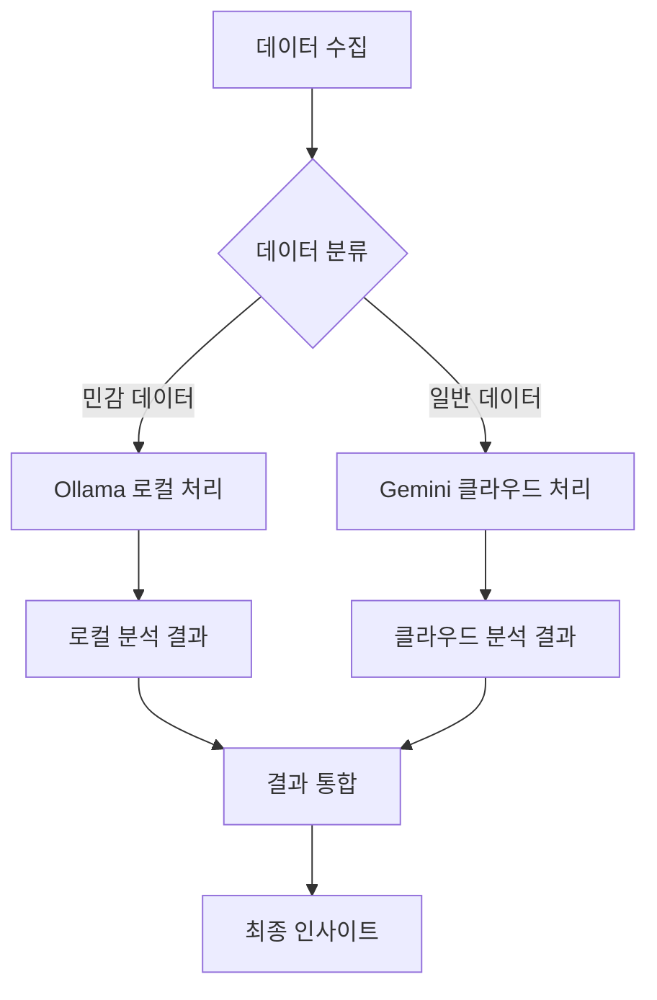

# AIRIS-MON AIOps/MLOps 확장 아키텍처 설계

## 1. 현재 시스템 분석 결과

### 1.1 기존 AIRIS-MON 구조
현재 시스템은 다음과 같은 구조를 가지고 있습니다:

#### 핵심 컴포넌트
- **메인 서버** (`src/index.ts`): Express.js 기반 REST API 서버
- **데이터베이스 서비스** (`src/services/database.ts`): MongoDB, Redis, PostgreSQL, InfluxDB 멀티 DB 지원
- **ClickStack 아키텍처**: 마이크로서비스 기반의 관측성 플랫폼
  - API Gateway
  - Data Ingestion Service
  - Analytics Engine 
  - Alert Manager
  - Session Replay
  - NLP Search
  - Event Delta Analyzer

#### 데이터 모델
- **Wide Events 테이블**: 통합 관측성 데이터 모델 (ClickHouse 기반)
- **한국 시간대 최적화**: `Asia/Seoul` 타임존 지원
- **실시간 집계**: Materialized Views를 통한 실시간 메트릭 집계

#### 기존 ML 컴포넌트
- **AIOps ML Engine** (`clickstack-architecture/services/aiops/src/ml-engine.js`):
  - 이상 탐지 (Autoencoder)
  - 시계열 예측 (LSTM)
  - 근본 원인 분석 (RCA)
  - 패턴 클러스터링

### 1.2 확장 가능 지점 식별

#### 데이터 수집 레이어
- 현재: OpenTelemetry 기반 트레이싱, 메트릭, 로그 수집
- 확장 필요: 외부 시스템 지식 수집, 실시간 스트리밍

#### 분석 레이어
- 현재: 기본적인 ML 모델 (TensorFlow.js)
- 확장 필요: Ollama + Gemini 3.1B 통합, 고급 통계 분석

#### 저장 레이어
- 현재: ClickHouse 기반 시계열 데이터
- 확장 필요: 벡터 DB, 지식 그래프, ML 모델 저장소

## 2. AIOps/MLOps 통합 아키텍처

### 2.1 전체 시스템 아키텍처

```
┌─────────────────────────────────────────────────────────────────┐
│                    AIRIS-MON Enhanced Platform                 │
├─────────────────────────────────────────────────────────────────┤
│                     API Gateway & Load Balancer                │
├─────────┬─────────┬─────────┬─────────┬─────────┬─────────┬─────┤
│ Data    │Analytics│ Alert   │ AIOps   │ MLOps   │ Knowledge│ Web │
│Ingestion│ Engine  │ Manager │ Engine  │Platform │ Manager  │ UI  │
├─────────┼─────────┼─────────┼─────────┼─────────┼─────────┼─────┤
│         │         │         │ Ollama  │ Model   │ External │     │
│         │         │         │ + Gemini│Registry │ Systems  │     │
│         │         │         │ 3.1B    │         │ Connector│     │
├─────────┴─────────┴─────────┴─────────┴─────────┴─────────┴─────┤
│           Message Queue & Event Streaming (Apache Kafka)       │
├─────────┬─────────┬─────────┬─────────┬─────────┬─────────┬─────┤
│ Metrics │ Time    │ Event   │ Vector  │ Model   │Knowledge│User │
│ Store   │ Series  │ Store   │ DB      │ Store   │ Graph   │Store│
│(ClickH) │(InfluxDB)│(Postgres)│(Chroma) │(MinIO)  │(Neo4j)  │(Mongo)│
└─────────┴─────────┴─────────┴─────────┴─────────┴─────────┴─────┘
```

### 2.2 새로운 컴포넌트 설계

#### A. AIOps Engine (Enhanced)
```typescript
interface AIOpsEngine {
  // 이상 탐지
  anomalyDetection: {
    realTimeDetector: AnomalyDetector;
    multivarateAnalysis: MultivariateAnomalyDetector;
    seasonalityDetector: SeasonalAnomalyDetector;
  };
  
  // 예측 분석
  predictiveAnalytics: {
    timeSeriesForecasting: TimeSeriesPredictor;
    failurePrediction: FailurePredictor;
    capacityPlanning: CapacityPredictor;
  };
  
  // 근본 원인 분석
  rootCauseAnalysis: {
    dependencyAnalyzer: DependencyAnalyzer;
    correlationEngine: CorrelationEngine;
    knowledgeBasedRCA: KnowledgeBasedRCA;
  };
  
  // 자동 복구
  autoRemediation: {
    actionRecommender: ActionRecommender;
    workflowExecutor: WorkflowExecutor;
    impactAssessment: ImpactAssessment;
  };
}
```

#### B. MLOps Platform
```typescript
interface MLOpsPlatform {
  // 모델 관리
  modelManagement: {
    registry: ModelRegistry;
    versioning: ModelVersioning;
    deployment: ModelDeployment;
    monitoring: ModelMonitoring;
  };
  
  // 실험 관리
  experimentTracking: {
    experimentLogger: ExperimentLogger;
    hyperparameterTuning: HyperparameterTuner;
    compareManager: CompareManager;
  };
  
  // 파이프라인 관리
  pipelineManagement: {
    trainingPipeline: TrainingPipelineOrchestrator;
    inferencePipeline: InferencePipelineOrchestrator;
    dataValidation: DataValidationPipeline;
  };
  
  // 모니터링
  modelObservability: {
    driftDetection: DataDriftDetector;
    performanceMonitoring: ModelPerformanceMonitor;
    biasDetection: BiasDetector;
  };
}
```

#### C. Knowledge Manager
```typescript
interface KnowledgeManager {
  // 외부 시스템 연동
  externalConnectors: {
    appConnector: ApplicationConnector;
    networkConnector: NetworkConnector;
    webConnector: WebConnector;
    wasConnector: WASConnector;
  };
  
  // 지식 추출
  knowledgeExtraction: {
    documentProcessor: DocumentProcessor;
    logAnalyzer: LogAnalyzer;
    configurationAnalyzer: ConfigurationAnalyzer;
  };
  
  // 지식 저장
  knowledgeStorage: {
    vectorStore: VectorStore;
    knowledgeGraph: KnowledgeGraph;
    ontologyManager: OntologyManager;
  };
  
  // 지식 활용
  knowledgeApplication: {
    semanticSearch: SemanticSearch;
    contextualRecommendation: ContextualRecommendation;
    intelligentQuerying: IntelligentQuerying;
  };
}
```

### 2.3 Ollama + Gemini 3.1B 통합 아키텍처

#### 통합 전략
```typescript
interface OllamaGeminiIntegration {
  // Ollama 로컬 처리
  localProcessing: {
    privateDataAnalysis: PrivateDataAnalyzer;
    realTimeInference: RealTimeInferenceEngine;
    localKnowledgeBase: LocalKnowledgeBase;
  };
  
  // Gemini 클라우드 처리
  cloudProcessing: {
    complexAnalysis: ComplexAnalysisEngine;
    largeScaleTraining: LargeScaleTrainingEngine;
    globalKnowledgeAccess: GlobalKnowledgeAccessor;
  };
  
  // 하이브리드 워크플로우
  hybridWorkflow: {
    taskRouter: TaskRouter;
    dataPrivacyManager: DataPrivacyManager;
    resultAggregator: ResultAggregator;
  };
}
```

#### 처리 흐름


## 3. 외부 시스템 지식 수집 메커니즘

### 3.1 멀티 시스템 커넥터 아키텍처

#### Application Layer Connector
```typescript
interface ApplicationConnector {
  // 애플리케이션 메트릭
  metricsCollector: {
    jvmMetrics: JVMMetricsCollector;
    nodeMetrics: NodeMetricsCollector;
    pythonMetrics: PythonMetricsCollector;
    customMetrics: CustomMetricsCollector;
  };
  
  // 애플리케이션 로그
  logCollector: {
    structuredLogs: StructuredLogCollector;
    unstructuredLogs: UnstructuredLogCollector;
    errorLogs: ErrorLogCollector;
  };
  
  // 애플리케이션 트레이스
  traceCollector: {
    distributedTracing: DistributedTracingCollector;
    localTracing: LocalTracingCollector;
    userJourneyTracing: UserJourneyTracingCollector;
  };
}
```

#### Network Layer Connector
```typescript
interface NetworkConnector {
  // 네트워크 메트릭
  networkMetrics: {
    bandwidthMonitor: BandwidthMonitor;
    latencyMonitor: LatencyMonitor;
    packetLossMonitor: PacketLossMonitor;
    connectionMonitor: ConnectionMonitor;
  };
  
  // 네트워크 이벤트
  networkEvents: {
    securityEvents: SecurityEventCollector;
    performanceEvents: PerformanceEventCollector;
    configurationEvents: ConfigurationEventCollector;
  };
  
  // 네트워크 토폴로지
  topologyDiscovery: {
    deviceDiscovery: DeviceDiscovery;
    connectionMapping: ConnectionMapper;
    dependencyAnalysis: DependencyAnalyzer;
  };
}
```

#### WEB/WAS Layer Connector
```typescript
interface WebWASConnector {
  // 웹 서버 메트릭
  webServerMetrics: {
    requestMetrics: RequestMetricsCollector;
    responseMetrics: ResponseMetricsCollector;
    errorMetrics: ErrorMetricsCollector;
  };
  
  // WAS 메트릭
  wasMetrics: {
    threadPoolMetrics: ThreadPoolMetricsCollector;
    connectionPoolMetrics: ConnectionPoolMetricsCollector;
    memoryMetrics: MemoryMetricsCollector;
  };
  
  // 사용자 경험 메트릭
  userExperienceMetrics: {
    pageLoadMetrics: PageLoadMetricsCollector;
    interactionMetrics: InteractionMetricsCollector;
    errorExperienceMetrics: ErrorExperienceMetricsCollector;
  };
}
```

### 3.2 실시간 데이터 파이프라인

```typescript
interface RealTimeDataPipeline {
  // 데이터 수집
  ingestion: {
    streamingIngestion: StreamingIngestionService;
    batchIngestion: BatchIngestionService;
    realTimeValidation: RealTimeValidationService;
  };
  
  // 데이터 변환
  transformation: {
    schemaMapping: SchemaMapper;
    dataEnrichment: DataEnrichmentService;
    anomalyPreprocessing: AnomalyPreprocessor;
  };
  
  // 데이터 라우팅
  routing: {
    eventRouter: EventRouter;
    priorityQueue: PriorityQueueManager;
    loadBalancer: LoadBalancer;
  };
}
```

## 4. 통계적 분석 파이프라인 설계

### 4.1 다차원 분석 엔진

#### 시계열 분석
```typescript
interface TimeSeriesAnalysis {
  // 기본 통계
  descriptiveStats: {
    trend: TrendAnalyzer;
    seasonality: SeasonalityDetector;
    cyclicality: CyclicalityDetector;
    stationarity: StationarityTester;
  };
  
  // 고급 분석
  advancedAnalysis: {
    changePointDetection: ChangePointDetector;
    forecastingModels: ForecastingModels;
    correlationAnalysis: CorrelationAnalyzer;
    causalityAnalysis: CausalityAnalyzer;
  };
  
  // 멀티변량 분석
    multivariateAnalysis: {
    principalComponentAnalysis: PCAAnalyzer;
    independentComponentAnalysis: ICAAnalyzer;
    factorAnalysis: FactorAnalyzer;
  };
}
```

#### 패턴 분석
```typescript
interface PatternAnalysis {
  // 클러스터링
  clustering: {
    timeSeriesClustering: TimeSeriesClusterer;
    densityBasedClustering: DensityBasedClusterer;
    hierarchicalClustering: HierarchicalClusterer;
  };
  
  // 분류
  classification: {
    anomalyClassification: AnomalyClassifier;
    eventClassification: EventClassifier;
    severityClassification: SeverityClassifier;
  };
  
  // 연관규칙
  associationRules: {
    frequentPatternMining: FrequentPatternMiner;
    sequentialPatternMining: SequentialPatternMiner;
    temporalAssociationRules: TemporalAssociationRuleMiner;
  };
}
```

### 4.2 한국 비즈니스 특화 분석

#### 한국 시간대 분석
```typescript
interface KoreanBusinessAnalysis {
  // 업무시간 분석
  businessHoursAnalysis: {
    peakHourDetection: PeakHourDetector;
    lunchTimeImpact: LunchTimeImpactAnalyzer;
    weekendPatterns: WeekendPatternAnalyzer;
  };
  
  // 계절성 분석
  seasonalAnalysis: {
    holidayImpact: HolidayImpactAnalyzer;
    seasonalTrends: SeasonalTrendAnalyzer;
    yearEndPatterns: YearEndPatternAnalyzer;
  };
  
  // 문화적 패턴
  culturalPatterns: {
    workCultureAnalysis: WorkCultureAnalyzer;
    digitalUsagePatterns: DigitalUsagePatternAnalyzer;
    eventDrivenPatterns: EventDrivenPatternAnalyzer;
  };
}
```

## 5. 기술 스택 및 의존성

### 5.1 새로운 기술 스택

#### AI/ML 플랫폼
```yaml
ai_ml_stack:
  local_inference:
    - ollama: "latest"
    - llama-cpp: "latest"
    - onnx-runtime: "latest"
  
  cloud_inference:
    - google-gemini: "3.1B"
    - openai-api: "gpt-4"
    - anthropic-claude: "latest"
  
  ml_frameworks:
    - tensorflow: "2.15+"
    - pytorch: "2.1+"
    - scikit-learn: "1.3+"
    - xgboost: "2.0+"
  
  vector_databases:
    - chroma: "latest"
    - weaviate: "1.22+"
    - pinecone: "cloud"
```

#### 데이터 플랫폼
```yaml
data_platform:
  streaming:
    - apache-kafka: "3.6+"
    - kafka-streams: "3.6+"
    - kafka-connect: "3.6+"
  
  storage:
    - clickhouse: "23.8+"
    - neo4j: "5.13+"
    - minio: "latest"
    - redis: "7.2+"
  
  processing:
    - apache-spark: "3.5+"
    - dask: "2023.12+"
    - ray: "2.8+"
```

#### 인프라 스택
```yaml
infrastructure:
  container_orchestration:
    - kubernetes: "1.28+"
    - helm: "3.13+"
    - istio: "1.19+"
  
  monitoring:
    - prometheus: "2.47+"
    - grafana: "10.2+"
    - jaeger: "1.51+"
    - opentelemetry: "1.21+"
  
  deployment:
    - argocd: "2.9+"
    - tekton: "0.53+"
    - harbor: "2.9+"
```

### 5.2 의존성 관리

#### NPM 패키지 추가
```json
{
  "dependencies": {
    "@tensorflow/tfjs-node": "^4.15.0",
    "@huggingface/transformers": "^2.6.0",
    "ollama": "^0.4.0",
    "chromadb": "^1.5.0",
    "neo4j-driver": "^5.15.0",
    "apache-kafka": "^0.6.0",
    "ml-matrix": "^6.10.0",
    "simple-statistics": "^7.8.0",
    "fft-js": "^0.0.12"
  },
  "devDependencies": {
    "@types/tensorflow__tfjs-node": "^1.3.0"
  }
}
```

#### Python 패키지 (마이크로서비스용)
```txt
tensorflow>=2.15.0
torch>=2.1.0
scikit-learn>=1.3.0
pandas>=2.1.0
numpy>=1.24.0
scipy>=1.11.0
matplotlib>=3.7.0
seaborn>=0.12.0
plotly>=5.17.0
streamlit>=1.28.0
mlflow>=2.8.0
dvc>=3.34.0
```

## 6. 구현 우선순위 및 단계별 계획

### 6.1 Phase 1: 기반 구조 구축 (1-2개월)

#### 우선순위 1: 데이터 파이프라인 확장
```typescript
// 목표: 외부 시스템 데이터 수집 기반 구축
interface Phase1Objectives {
  dataIngestion: {
    tasks: [
      "멀티 시스템 커넥터 구현",
      "실시간 스트리밍 파이프라인 구축",
      "데이터 검증 및 품질 관리"
    ];
    deliverables: [
      "External System Connectors",
      "Real-time Data Pipeline",
      "Data Validation Framework"
    ];
  };
  
  infrastructure: {
    tasks: [
      "벡터 데이터베이스 구축",
      "지식 그래프 시스템 설계",
      "모델 저장소 구축"
    ];
    deliverables: [
      "Vector Database (Chroma)",
      "Knowledge Graph (Neo4j)",
      "Model Registry (MinIO)"
    ];
  };
}
```

#### 우선순위 2: Ollama 통합
```typescript
interface OllamaIntegration {
  setup: {
    tasks: [
      "Ollama 서버 구축",
      "Gemini 3.1B 모델 배포",
      "API 래퍼 개발"
    ];
    deliverables: [
      "Ollama Service",
      "Model API Gateway",
      "Local Inference Engine"
    ];
  };
}
```

### 6.2 Phase 2: AI 분석 엔진 구현 (2-3개월)

#### 우선순위 1: 고급 이상 탐지
```typescript
interface Phase2AnomalyDetection {
  multivariate: {
    tasks: [
      "다변량 이상 탐지 모델 구현",
      "계절성 패턴 분석기 개발",
      "실시간 이상 탐지 파이프라인"
    ];
    models: [
      "Isolation Forest",
      "LSTM Autoencoder",
      "VAE (Variational Autoencoder)",
      "One-Class SVM"
    ];
  };
}
```

#### 우선순위 2: 예측 분석
```typescript
interface Phase2PredictiveAnalytics {
  forecasting: {
    tasks: [
      "시계열 예측 모델 구현",
      "용량 계획 엔진 개발",
      "장애 예측 시스템"
    ];
    models: [
      "Prophet",
      "ARIMA/SARIMA",
      "LSTM Networks",
      "Transformer Models"
    ];
  };
}
```

### 6.3 Phase 3: MLOps 플랫폼 구축 (3-4개월)

#### 모델 생명주기 관리
```typescript
interface Phase3MLOps {
  modelManagement: {
    tasks: [
      "모델 레지스트리 구현",
      "자동화된 모델 배포",
      "모델 성능 모니터링"
    ];
    components: [
      "MLflow Integration",
      "Model Versioning",
      "A/B Testing Framework",
      "Model Drift Detection"
    ];
  };
}
```

### 6.4 Phase 4: 지식 관리 시스템 (4-5개월)

#### 통합 지식 플랫폼
```typescript
interface Phase4KnowledgeManagement {
  knowledgeGraph: {
    tasks: [
      "자동화된 지식 추출",
      "의미론적 검색 엔진",
      "컨텍스트 기반 추천"
    ];
    capabilities: [
      "Document Processing",
      "Entity Recognition",
      "Relationship Extraction",
      "Semantic Search"
    ];
  };
}
```

### 6.5 Phase 5: 고급 분석 및 최적화 (5-6개월)

#### 전체 시스템 최적화
```typescript
interface Phase5Optimization {
  performance: {
    tasks: [
      "실시간 처리 성능 최적화",
      "분산 처리 시스템 구축",
      "자동 스케일링 구현"
    ];
    targets: [
      "Sub-second Response Time",
      "99.99% Availability",
      "Horizontal Scalability"
    ];
  };
}
```

## 7. 성공 지표 및 검증 계획

### 7.1 KPI 정의
```typescript
interface SuccessMetrics {
  technical: {
    performance: {
      responseTime: "< 100ms for 95% of queries";
      throughput: "> 10,000 events/second";
      accuracy: "> 95% for anomaly detection";
    };
    reliability: {
      uptime: "> 99.9%";
      dataLoss: "< 0.01%";
      falsePositive: "< 5%";
    };
  };
  
  business: {
    efficiency: {
      mttr: "50% reduction in MTTR";
      alertNoise: "70% reduction in false alerts";
      automatedResolution: "> 60% of incidents";
    };
    costSavings: {
      infrastructureCost: "30% reduction";
      operationalCost: "40% reduction";
      timeToInsight: "80% faster";
    };
  };
}
```

### 7.2 검증 방법론
```typescript
interface ValidationApproach {
  testing: {
    unitTests: "90% code coverage";
    integrationTests: "Complete workflow testing";
    performanceTests: "Load and stress testing";
    chaosEngineering: "Fault injection testing";
  };
  
  monitoring: {
    realTimeMetrics: "Comprehensive observability";
    businessMetrics: "ROI measurement";
    userFeedback: "Satisfaction surveys";
  };
}
```

## 8. 위험 관리 및 완화 전략

### 8.1 기술적 위험
```typescript
interface TechnicalRisks {
  dataQuality: {
    risk: "외부 시스템 데이터 품질 불량";
    mitigation: [
      "데이터 검증 파이프라인",
      "이상 데이터 필터링",
      "데이터 품질 모니터링"
    ];
  };
  
  modelDrift: {
    risk: "ML 모델 성능 저하";
    mitigation: [
      "지속적 모델 모니터링",
      "자동 재학습 파이프라인",
      "A/B 테스트 프레임워크"
    ];
  };
  
  scalability: {
    risk: "시스템 확장성 제한";
    mitigation: [
      "마이크로서비스 아키텍처",
      "수평적 확장 설계",
      "캐싱 전략"
    ];
  };
}
```

### 8.2 운영적 위험
```typescript
interface OperationalRisks {
  complexity: {
    risk: "시스템 복잡도 증가";
    mitigation: [
      "명확한 문서화",
      "단계적 구현",
      "운영 자동화"
    ];
  };
  
  skillGap: {
    risk: "기술 역량 부족";
    mitigation: [
      "교육 프로그램",
      "외부 컨설팅",
      "점진적 학습"
    ];
  };
}
```

## 9. 결론

이 AIOps/MLOps 확장 계획은 기존 AIRIS-MON 시스템을 기반으로 다음과 같은 핵심 가치를 제공합니다:

1. **지능형 모니터링**: Ollama + Gemini 3.1B를 활용한 고급 AI 분석
2. **통합 관측성**: 외부 시스템 통합을 통한 전체적 가시성
3. **예측적 운영**: 장애 예측 및 자동 복구 capabilities
4. **한국 특화**: 한국 비즈니스 환경에 최적화된 분석
5. **확장 가능성**: 미래 요구사항에 대응 가능한 아키텍처

이 계획을 통해 AIRIS-MON은 단순한 모니터링 플랫폼에서 지능형 AIOps/MLOps 플랫폼으로 진화할 수 있습니다.