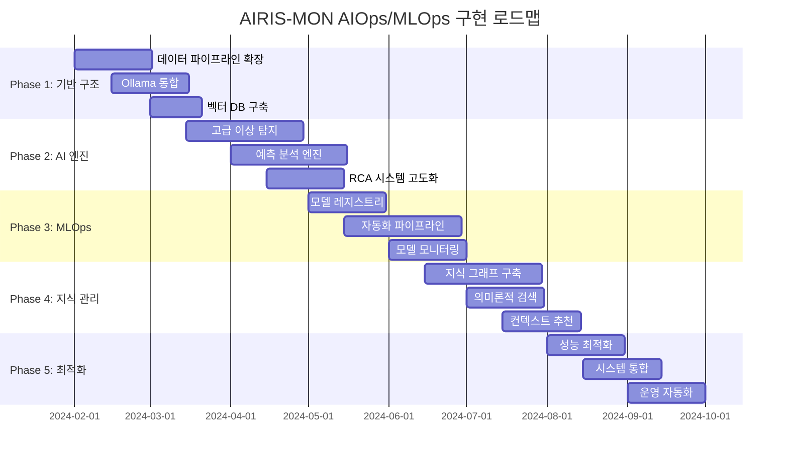

# AIRIS-MON AIOps/MLOps 구현 로드맵

## 전체 구현 일정



## Phase 1: 기반 구조 구축 (2024.02 - 2024.03)

### 1.1 데이터 파이프라인 확장

#### 목표
- 외부 시스템 데이터 수집 기반 구축
- 실시간 스트리밍 파이프라인 구현
- 데이터 품질 관리 시스템 구축

#### 주요 작업
```typescript
// 1. 멀티 시스템 커넥터 구현
interface SystemConnectors {
  application: {
    jvm: JVMConnector;
    nodejs: NodeJSConnector;
    python: PythonConnector;
    dotnet: DotNetConnector;
  };
  
  network: {
    snmp: SNMPConnector;
    netflow: NetflowConnector;
    syslog: SyslogConnector;
  };
  
  infrastructure: {
    kubernetes: K8sConnector;
    docker: DockerConnector;
    linux: LinuxConnector;
    windows: WindowsConnector;
  };
}

// 2. 실시간 스트리밍 파이프라인
interface StreamingPipeline {
  ingestion: KafkaIngestionService;
  processing: KafkaStreamsProcessor;
  routing: EventRouter;
  validation: DataValidator;
}
```

#### 구현 상세
1. **외부 시스템 커넥터**
   ```bash
   mkdir -p src/connectors/{application,network,infrastructure}
   mkdir -p src/connectors/application/{jvm,nodejs,python,dotnet}
   mkdir -p src/connectors/network/{snmp,netflow,syslog}
   mkdir -p src/connectors/infrastructure/{k8s,docker,linux,windows}
   ```

2. **데이터 검증 프레임워크**
   ```typescript
   class DataValidator {
     async validateSchema(data: any, schema: Schema): Promise<ValidationResult>
     async checkDataQuality(data: any): Promise<QualityScore>
     async detectAnomalousData(data: any): Promise<boolean>
   }
   ```

3. **스트리밍 처리**
   ```typescript
   class KafkaStreamsProcessor {
     async processMetrics(stream: KafkaStream): Promise<void>
     async processLogs(stream: KafkaStream): Promise<void>
     async processTraces(stream: KafkaStream): Promise<void>
   }
   ```

#### 결과물
- External System Connectors (10+ 커넥터)
- Real-time Data Pipeline (Kafka 기반)
- Data Validation Framework
- 성능 목표: 10,000 events/sec 처리

### 1.2 Ollama 통합

#### 목표
- Ollama 서버 구축 및 Gemini 3.1B 모델 배포
- 로컬 추론 엔진 구현
- 프라이버시 보장 하이브리드 처리

#### 구현 계획
```typescript
// Ollama 서비스 아키텍처
interface OllamaService {
  modelManager: {
    loadModel(modelName: string): Promise<ModelInstance>;
    unloadModel(modelName: string): Promise<void>;
    listModels(): Promise<ModelInfo[]>;
  };
  
  inferenceEngine: {
    generateText(prompt: string, options?: GenerationOptions): Promise<string>;
    embedText(text: string): Promise<number[]>;
    classifyText(text: string, categories: string[]): Promise<Classification>;
  };
  
  privacyManager: {
    classifyData(data: any): Promise<PrivacyLevel>;
    sanitizeData(data: any): Promise<any>;
    routeToProcessor(data: any): Promise<ProcessorType>;
  };
}
```

#### 구현 단계
1. **Ollama 서버 설정**
   ```bash
   # Docker Compose로 Ollama 서버 구축
   docker run -d \
     --name ollama \
     --gpus=all \
     -v ollama:/root/.ollama \
     -p 11434:11434 \
     ollama/ollama
   
   # Gemini 3.1B 모델 설치
   docker exec -it ollama ollama pull gemini:3.1b
   ```

2. **API 래퍼 구현**
   ```typescript
   class OllamaAPIWrapper {
     constructor(private baseURL: string) {}
     
     async chat(messages: Message[]): Promise<ChatResponse>
     async embed(text: string): Promise<EmbeddingResponse>
     async generate(prompt: string): Promise<GenerationResponse>
   }
   ```

3. **하이브리드 처리 로직**
   ```typescript
   class HybridProcessor {
     async route(data: ProcessingRequest): Promise<ProcessingResponse> {
       const privacyLevel = await this.classifyPrivacy(data);
       
       if (privacyLevel === 'HIGH') {
         return await this.processLocally(data);
       } else {
         return await this.processInCloud(data);
       }
     }
   }
   ```

#### 결과물
- Ollama 서비스 (Docker 컨테이너)
- Model API Gateway
- Privacy-aware Processing Engine
- 성능 목표: < 2초 추론 시간

### 1.3 벡터 데이터베이스 구축

#### 목표
- 임베딩 기반 유사도 검색
- 지식 베이스 구축 기반
- 실시간 벡터 인덱싱

#### 구현 계획
```typescript
interface VectorDatabase {
  indexing: {
    createCollection(name: string, dimension: number): Promise<Collection>;
    addVectors(collection: string, vectors: Vector[]): Promise<void>;
    updateVectors(collection: string, vectors: Vector[]): Promise<void>;
    deleteVectors(collection: string, ids: string[]): Promise<void>;
  };
  
  search: {
    similaritySearch(vector: number[], k: number): Promise<SearchResult[]>;
    hybridSearch(query: string, vector: number[]): Promise<SearchResult[]>;
    rangeSearch(vector: number[], radius: number): Promise<SearchResult[]>;
  };
  
  management: {
    listCollections(): Promise<Collection[]>;
    getCollectionStats(name: string): Promise<CollectionStats>;
    optimizeCollection(name: string): Promise<void>;
  };
}
```

#### 기술 스택
- **Chroma DB**: 로컬 벡터 저장소
- **Weaviate**: 분산 벡터 검색
- **Pinecone**: 클라우드 벡터 서비스 (옵션)

#### 구현 단계
1. **Chroma DB 설정**
   ```python
   import chromadb
   
   # Chroma 클라이언트 초기화
   client = chromadb.Client()
   
   # 컬렉션 생성
   collection = client.create_collection(
       name="airis_knowledge",
       metadata={"description": "AIRIS-MON knowledge base"}
   )
   ```

2. **벡터 인덱싱 서비스**
   ```typescript
   class VectorIndexingService {
     async indexDocument(doc: Document): Promise<void> {
       const embedding = await this.generateEmbedding(doc.content);
       await this.vectorDB.add({
         id: doc.id,
         vector: embedding,
         metadata: doc.metadata
       });
     }
     
     async searchSimilar(query: string, k: number = 10): Promise<SearchResult[]> {
       const queryEmbedding = await this.generateEmbedding(query);
       return await this.vectorDB.search(queryEmbedding, k);
     }
   }
   ```

#### 결과물
- Vector Database Service (Chroma/Weaviate)
- Embedding Generation Pipeline
- Similarity Search API
- 성능 목표: < 50ms 검색 응답 시간

## Phase 2: AI 분석 엔진 구현 (2024.03 - 2024.05)

### 2.1 고급 이상 탐지

#### 목표
- 다변량 이상 탐지 구현
- 실시간 이상 탐지 파이프라인
- 컨텍스트 인식 이상 탐지

#### 구현 계획
```typescript
interface AdvancedAnomalyDetection {
  multivariate: {
    isolationForest: IsolationForestDetector;
    autoencoderLSTM: LSTMAutoencoderDetector;
    variationalAutoencoder: VAEDetector;
    oneClassSVM: OneClassSVMDetector;
  };
  
  temporal: {
    seasonalDecomposition: SeasonalAnomalyDetector;
    changePointDetection: ChangePointDetector;
    timeSeriesOutlier: TimeSeriesOutlierDetector;
  };
  
  contextual: {
    businessHoursDetector: BusinessHoursAnomalyDetector;
    serviceSpecificDetector: ServiceSpecificAnomalyDetector;
    correlatedAnomalyDetector: CorrelatedAnomalyDetector;
  };
}
```

#### 모델 구현
1. **LSTM Autoencoder**
   ```python
   import tensorflow as tf
   
   class LSTMAutoencoder:
       def __init__(self, sequence_length, n_features):
           self.model = tf.keras.Sequential([
               # Encoder
               tf.keras.layers.LSTM(128, return_sequences=True),
               tf.keras.layers.LSTM(64, return_sequences=False),
               tf.keras.layers.RepeatVector(sequence_length),
               # Decoder
               tf.keras.layers.LSTM(64, return_sequences=True),
               tf.keras.layers.LSTM(128, return_sequences=True),
               tf.keras.layers.TimeDistributed(tf.keras.layers.Dense(n_features))
           ])
   ```

2. **Isolation Forest**
   ```python
   from sklearn.ensemble import IsolationForest
   
   class IsolationForestDetector:
       def __init__(self, contamination=0.1):
           self.model = IsolationForest(
               contamination=contamination,
               random_state=42,
               n_jobs=-1
           )
       
       def fit_predict(self, X):
           return self.model.fit_predict(X)
   ```

3. **실시간 처리 파이프라인**
   ```typescript
   class RealTimeAnomalyPipeline {
     async processStream(dataStream: DataStream): Promise<void> {
       await dataStream.forEach(async (dataPoint) => {
         const features = await this.extractFeatures(dataPoint);
         const anomalyScore = await this.detectAnomaly(features);
         
         if (anomalyScore > this.threshold) {
           await this.triggerAlert(dataPoint, anomalyScore);
         }
         
         await this.updateBaseline(features);
       });
     }
   }
   ```

#### 결과물
- Multi-Model Anomaly Detection System
- Real-time Processing Pipeline
- Context-aware Detection Logic
- 성능 목표: 95% 정확도, < 1초 탐지 시간

### 2.2 예측 분석 엔진

#### 목표
- 시계열 예측 모델 구현
- 장애 예측 시스템
- 용량 계획 엔진

#### 구현 계획
```typescript
interface PredictiveAnalyticsEngine {
  forecasting: {
    prophet: ProphetForecaster;
    arima: ARIMAForecaster;
    lstm: LSTMForecaster;
    transformer: TransformerForecaster;
  };
  
  failurePrediction: {
    cascadeFailurePredictor: CascadeFailurePredictor;
    resourceExhaustionPredictor: ResourceExhaustionPredictor;
    performanceDegradationPredictor: PerformanceDegradationPredictor;
  };
  
  capacityPlanning: {
    resourceDemandForecaster: ResourceDemandForecaster;
    scalingRecommender: ScalingRecommender;
    costOptimizer: CostOptimizer;
  };
}
```

#### 모델 구현
1. **Prophet 예측 모델**
   ```python
   from prophet import Prophet
   
   class ProphetForecaster:
       def __init__(self):
           self.model = Prophet(
               yearly_seasonality=True,
               weekly_seasonality=True,
               daily_seasonality=True
           )
       
       def forecast(self, df, periods=24):
           self.model.fit(df)
           future = self.model.make_future_dataframe(periods=periods, freq='H')
           return self.model.predict(future)
   ```

2. **LSTM 예측 모델**
   ```python
   class LSTMForecaster:
       def __init__(self, sequence_length=24, n_features=10):
           self.model = tf.keras.Sequential([
               tf.keras.layers.LSTM(128, return_sequences=True),
               tf.keras.layers.Dropout(0.2),
               tf.keras.layers.LSTM(64, return_sequences=False),
               tf.keras.layers.Dropout(0.2),
               tf.keras.layers.Dense(32, activation='relu'),
               tf.keras.layers.Dense(1)
           ])
   ```

3. **장애 예측 로직**
   ```typescript
   class FailurePredictionEngine {
     async predictFailure(metrics: TimeSeriesData): Promise<FailurePrediction> {
       const predictions = await Promise.all([
         this.predictResourceExhaustion(metrics),
         this.predictPerformanceDegradation(metrics),
         this.predictCascadeFailure(metrics)
       ]);
       
       return this.combineResults(predictions);
     }
   }
   ```

#### 결과물
- Multi-Model Forecasting System
- Failure Prediction Engine
- Capacity Planning Recommendations
- 성능 목표: 80% 예측 정확도

### 2.3 RCA 시스템 고도화

#### 목표
- 자동화된 근본 원인 분석
- 의존성 그래프 기반 분석
- 지식 기반 RCA

#### 구현 계획
```typescript
interface EnhancedRCASystem {
  dependencyAnalysis: {
    serviceTopologyMapper: ServiceTopologyMapper;
    dependencyGraphBuilder: DependencyGraphBuilder;
    impactAnalyzer: ImpactAnalyzer;
  };
  
  correlationEngine: {
    temporalCorrelationAnalyzer: TemporalCorrelationAnalyzer;
    spatialCorrelationAnalyzer: SpatialCorrelationAnalyzer;
    causalityAnalyzer: CausalityAnalyzer;
  };
  
  knowledgeBasedRCA: {
    historicalPatternMatcher: HistoricalPatternMatcher;
    expertSystemRules: ExpertSystemRules;
    machineLearnedPatterns: MLPatternMatcher;
  };
}
```

#### 구현 단계
1. **의존성 그래프 구축**
   ```typescript
   class ServiceTopologyMapper {
     async buildTopology(services: Service[]): Promise<TopologyGraph> {
       const graph = new TopologyGraph();
       
       for (const service of services) {
         const dependencies = await this.discoverDependencies(service);
         graph.addNode(service);
         dependencies.forEach(dep => graph.addEdge(service, dep));
       }
       
       return graph;
     }
   }
   ```

2. **상관관계 분석**
   ```python
   class CorrelationAnalyzer:
       def analyze_temporal_correlation(self, timeseries_data):
           correlation_matrix = np.corrcoef(timeseries_data.T)
           return self.extract_significant_correlations(correlation_matrix)
       
       def analyze_granger_causality(self, x, y, max_lag=5):
           from statsmodels.tsa.stattools import grangercausalitytests
           return grangercausalitytests(np.column_stack([y, x]), max_lag)
   ```

3. **지식 기반 추론**
   ```typescript
   class KnowledgeBasedRCA {
     async analyzeIncident(incident: Incident): Promise<RCAResult> {
       const historicalMatches = await this.findSimilarIncidents(incident);
       const expertRules = await this.applyExpertRules(incident);
       const mlPredictions = await this.predictCauses(incident);
       
       return this.synthesizeResults(historicalMatches, expertRules, mlPredictions);
     }
   }
   ```

#### 결과물
- Automated RCA Engine
- Dependency Graph Builder
- Knowledge-based Inference System
- 성능 목표: 90% RCA 정확도

## Phase 3: MLOps 플랫폼 구축 (2024.05 - 2024.07)

### 3.1 모델 레지스트리

#### 목표
- 중앙 집중식 모델 관리
- 모델 버전 관리
- 모델 메타데이터 추적

#### 구현 계획
```typescript
interface ModelRegistry {
  modelManagement: {
    registerModel(model: ModelArtifact): Promise<ModelVersion>;
    updateModel(modelId: string, model: ModelArtifact): Promise<ModelVersion>;
    deleteModel(modelId: string): Promise<void>;
    listModels(filter?: ModelFilter): Promise<Model[]>;
  };
  
  versionControl: {
    createVersion(modelId: string, version: ModelVersion): Promise<void>;
    promoteVersion(modelId: string, versionId: string, stage: Stage): Promise<void>;
    rollbackVersion(modelId: string, versionId: string): Promise<void>;
    compareVersions(v1: string, v2: string): Promise<VersionComparison>;
  };
  
  metadata: {
    addMetadata(modelId: string, metadata: ModelMetadata): Promise<void>;
    searchByMetadata(query: MetadataQuery): Promise<Model[]>;
    getLineage(modelId: string): Promise<ModelLineage>;
  };
}
```

#### 구현 단계
1. **MLflow 통합**
   ```python
   import mlflow
   import mlflow.tensorflow
   
   class ModelRegistryService:
       def __init__(self, tracking_uri):
           mlflow.set_tracking_uri(tracking_uri)
           self.client = mlflow.tracking.MlflowClient()
       
       def register_model(self, model, name, description):
           with mlflow.start_run():
               mlflow.tensorflow.log_model(model, "model")
               model_uri = mlflow.get_artifact_uri("model")
               mlflow.register_model(model_uri, name, description)
   ```

2. **모델 저장소 (MinIO)**
   ```typescript
   class ModelArtifactStore {
     constructor(private minioClient: Minio.Client) {}
     
     async storeModel(modelId: string, modelFile: Buffer): Promise<string> {
       const objectName = `models/${modelId}/model.pkl`;
       await this.minioClient.putObject('mlops-bucket', objectName, modelFile);
       return objectName;
     }
     
     async retrieveModel(modelId: string): Promise<Buffer> {
       return await this.minioClient.getObject('mlops-bucket', `models/${modelId}/model.pkl`);
     }
   }
   ```

#### 결과물
- MLflow Model Registry
- MinIO Model Artifact Store
- Model Metadata Management
- Model Lineage Tracking

### 3.2 자동화 파이프라인

#### 목표
- CI/CD for ML 모델
- 자동화된 학습 파이프라인
- 모델 배포 자동화

#### 구현 계획
```typescript
interface MLPipeline {
  training: {
    dataValidation: DataValidationPipeline;
    featureEngineering: FeatureEngineeringPipeline;
    modelTraining: ModelTrainingPipeline;
    modelValidation: ModelValidationPipeline;
  };
  
  deployment: {
    modelPackaging: ModelPackagingPipeline;
    stagingDeployment: StagingDeploymentPipeline;
    productionDeployment: ProductionDeploymentPipeline;
    rollbackPipeline: RollbackPipeline;
  };
  
  monitoring: {
    performanceMonitoring: PerformanceMonitoringPipeline;
    driftDetection: DriftDetectionPipeline;
    alerting: AlertingPipeline;
  };
}
```

#### 파이프라인 구현
1. **학습 파이프라인 (Tekton)**
   ```yaml
   apiVersion: tekton.dev/v1beta1
   kind: Pipeline
   metadata:
     name: ml-training-pipeline
   spec:
     tasks:
     - name: data-validation
       taskRef:
         name: validate-data
     - name: feature-engineering
       taskRef:
         name: engineer-features
       runAfter: ["data-validation"]
     - name: model-training
       taskRef:
         name: train-model
       runAfter: ["feature-engineering"]
   ```

2. **배포 파이프라인**
   ```typescript
   class ModelDeploymentPipeline {
     async deployModel(modelVersion: ModelVersion): Promise<DeploymentResult> {
       // 1. 모델 검증
       const validationResult = await this.validateModel(modelVersion);
       if (!validationResult.isValid) {
         throw new Error('Model validation failed');
       }
       
       // 2. 패키징
       const package = await this.packageModel(modelVersion);
       
       // 3. 스테이징 배포
       await this.deployToStaging(package);
       
       // 4. 통합 테스트
       const testResult = await this.runIntegrationTests(package);
       
       // 5. 프로덕션 배포
       if (testResult.passed) {
         return await this.deployToProduction(package);
       }
     }
   }
   ```

#### 결과물
- Tekton-based ML Pipelines
- Automated Training Workflows
- Blue-Green Deployment Strategy
- Automated Rollback Mechanisms

### 3.3 모델 모니터링

#### 목표
- 실시간 모델 성능 모니터링
- 데이터 드리프트 탐지
- 모델 편향성 감지

#### 구현 계획
```typescript
interface ModelMonitoring {
  performanceTracking: {
    accuracyMonitor: AccuracyMonitor;
    latencyMonitor: LatencyMonitor;
    throughputMonitor: ThroughputMonitor;
    errorRateMonitor: ErrorRateMonitor;
  };
  
  driftDetection: {
    dataDriftDetector: DataDriftDetector;
    conceptDriftDetector: ConceptDriftDetector;
    featureDriftDetector: FeatureDriftDetector;
  };
  
  biasDetection: {
    fairnessMetrics: FairnessMetricsCalculator;
    biasDetector: BiasDetector;
    disparateImpactAnalyzer: DisparateImpactAnalyzer;
  };
}
```

#### 모니터링 구현
1. **데이터 드리프트 탐지**
   ```python
   from scipy.stats import ks_2samp
   import numpy as np
   
   class DataDriftDetector:
       def __init__(self, threshold=0.05):
           self.threshold = threshold
           self.reference_data = None
       
       def fit(self, reference_data):
           self.reference_data = reference_data
       
       def detect_drift(self, current_data):
           drift_scores = {}
           for feature in current_data.columns:
               statistic, p_value = ks_2samp(
                   self.reference_data[feature], 
                   current_data[feature]
               )
               drift_scores[feature] = {
                   'statistic': statistic,
                   'p_value': p_value,
                   'drift_detected': p_value < self.threshold
               }
           return drift_scores
   ```

2. **모델 성능 모니터링**
   ```typescript
   class ModelPerformanceMonitor {
     async trackPredictions(predictions: Prediction[]): Promise<void> {
       for (const prediction of predictions) {
         await this.recordMetrics({
           modelId: prediction.modelId,
           timestamp: prediction.timestamp,
           latency: prediction.latency,
           confidence: prediction.confidence,
           actual: prediction.actual // when available
         });
       }
     }
     
     async calculateAccuracy(modelId: string, timeWindow: TimeWindow): Promise<number> {
       const predictions = await this.getPredictions(modelId, timeWindow);
       const correct = predictions.filter(p => p.predicted === p.actual).length;
       return correct / predictions.length;
     }
   }
   ```

#### 결과물
- Real-time Model Performance Dashboard
- Automated Drift Detection Alerts
- Bias Detection Reports
- Model Health Scoring System

## Phase 4: 지식 관리 시스템 (2024.07 - 2024.08)

### 4.1 지식 그래프 구축

#### 목표
- 구조화된 도메인 지식 표현
- 자동화된 지식 추출
- 추론 기반 문제 해결

#### 구현 계획
```typescript
interface KnowledgeGraph {
  entityManagement: {
    createEntity(entity: Entity): Promise<EntityId>;
    updateEntity(id: EntityId, entity: Entity): Promise<void>;
    deleteEntity(id: EntityId): Promise<void>;
    findEntities(query: EntityQuery): Promise<Entity[]>;
  };
  
  relationshipManagement: {
    createRelationship(rel: Relationship): Promise<RelationshipId>;
    findRelationships(query: RelationshipQuery): Promise<Relationship[]>;
    traverseGraph(startNode: EntityId, pattern: TraversalPattern): Promise<Path[]>;
  };
  
  inference: {
    reasonAbout(query: InferenceQuery): Promise<InferenceResult>;
    findSimilarEntities(entity: Entity): Promise<Entity[]>;
    predictRelationships(entity: Entity): Promise<Relationship[]>;
  };
}
```

#### Neo4j 구현
1. **스키마 정의**
   ```cypher
   // 노드 라벨 정의
   CREATE CONSTRAINT FOR (s:Service) REQUIRE s.name IS UNIQUE;
   CREATE CONSTRAINT FOR (m:Metric) REQUIRE m.name IS UNIQUE;
   CREATE CONSTRAINT FOR (e:Event) REQUIRE e.id IS UNIQUE;
   CREATE CONSTRAINT FOR (a:Alert) REQUIRE a.id IS UNIQUE;
   
   // 인덱스 생성
   CREATE INDEX service_performance FOR (s:Service) ON (s.performance_score);
   CREATE INDEX metric_timestamp FOR (m:Metric) ON (m.timestamp);
   ```

2. **지식 추출 엔진**
   ```typescript
   class KnowledgeExtractionEngine {
     async extractFromLogs(logs: LogEntry[]): Promise<Entity[]> {
       const entities = [];
       
       for (const log of logs) {
         // NER을 사용한 엔티티 추출
         const nerResults = await this.nerModel.predict(log.message);
         
         // 관계 추출
         const relationships = await this.relationExtractor.extract(log.message);
         
         entities.push(...this.createEntities(nerResults, relationships));
       }
       
       return entities;
     }
   }
   ```

3. **자동 온톨로지 구축**
   ```python
   class OntologyBuilder:
       def __init__(self):
           self.graph = nx.DiGraph()
       
       def build_service_ontology(self, service_data):
           # 서비스 계층 구조 생성
           for service in service_data:
               self.graph.add_node(service['name'], **service['properties'])
               
               # 의존성 관계 추가
               for dependency in service['dependencies']:
                   self.graph.add_edge(service['name'], dependency, 
                                     relationship='DEPENDS_ON')
   ```

#### 결과물
- Neo4j Knowledge Graph
- Automated Knowledge Extraction
- Ontology Management System
- Graph-based Inference Engine

### 4.2 의미론적 검색

#### 목표
- 자연어 기반 지식 검색
- 컨텍스트 인식 검색
- 다중 모달 검색 지원

#### 구현 계획
```typescript
interface SemanticSearch {
  indexing: {
    indexDocument(doc: Document): Promise<void>;
    indexMultiModal(content: MultiModalContent): Promise<void>;
    updateIndex(docId: string, doc: Document): Promise<void>;
    deleteFromIndex(docId: string): Promise<void>;
  };
  
  search: {
    semanticSearch(query: string, options?: SearchOptions): Promise<SearchResult[]>;
    hybridSearch(query: HybridQuery): Promise<SearchResult[]>;
    contextualSearch(query: string, context: Context): Promise<SearchResult[]>;
    similaritySearch(vector: number[], k: number): Promise<SearchResult[]>;
  };
  
  ranking: {
    rerank(results: SearchResult[], query: string): Promise<SearchResult[]>;
    personalizeRanking(results: SearchResult[], user: User): Promise<SearchResult[]>;
    contextualRanking(results: SearchResult[], context: Context): Promise<SearchResult[]>;
  };
}
```

#### 검색 엔진 구현
1. **하이브리드 검색**
   ```python
   class HybridSearchEngine:
       def __init__(self, vector_store, text_index):
           self.vector_store = vector_store
           self.text_index = text_index
           self.reranker = CrossEncoder('ms-marco-MiniLM-L-6-v2')
       
       def search(self, query, k=10):
           # 벡터 검색
           vector_results = self.vector_store.similarity_search(query, k=k*2)
           
           # 텍스트 검색
           text_results = self.text_index.search(query, k=k*2)
           
           # 결과 병합 및 재정렬
           combined_results = self.merge_results(vector_results, text_results)
           return self.reranker.rank(query, combined_results)[:k]
   ```

2. **컨텍스트 인식 검색**
   ```typescript
   class ContextualSearchEngine {
     async search(query: string, context: Context): Promise<SearchResult[]> {
       // 컨텍스트를 쿼리에 통합
       const enrichedQuery = await this.enrichQuery(query, context);
       
       // 컨텍스트 기반 필터링
       const filters = this.buildContextFilters(context);
       
       // 검색 실행
       const results = await this.semanticSearch(enrichedQuery, { filters });
       
       // 컨텍스트 기반 재정렬
       return await this.contextualReranking(results, context);
     }
   }
   ```

#### 결과물
- Hybrid Search Engine (Text + Vector)
- Contextual Search Capabilities
- Real-time Search Indexing
- Multi-modal Content Search

### 4.3 컨텍스트 추천

#### 목표
- 상황 인식 추천 시스템
- 개인화된 대시보드
- 지능형 알림 시스템

#### 구현 계획
```typescript
interface ContextualRecommendation {
  dashboardRecommendation: {
    recommendWidgets(user: User, context: Context): Promise<Widget[]>;
    recommendMetrics(service: Service, context: Context): Promise<Metric[]>;
    recommendViews(currentView: View, context: Context): Promise<View[]>;
  };
  
  alertRecommendation: {
    recommendThresholds(metric: Metric, context: Context): Promise<Threshold[]>;
    recommendEscalation(alert: Alert, context: Context): Promise<EscalationPolicy>;
    recommendActions(incident: Incident, context: Context): Promise<Action[]>;
  };
  
  investigationRecommendation: {
    recommendRelatedEvents(event: Event, context: Context): Promise<Event[]>;
    recommendDrillDowns(currentView: View, context: Context): Promise<View[]>;
    recommendQueries(investigation: Investigation): Promise<Query[]>;
  };
}
```

#### 추천 시스템 구현
1. **협업 필터링**
   ```python
   from sklearn.metrics.pairwise import cosine_similarity
   
   class CollaborativeFilteringRecommender:
       def __init__(self):
           self.user_item_matrix = None
           self.similarity_matrix = None
       
       def fit(self, user_interactions):
           self.user_item_matrix = self.build_user_item_matrix(user_interactions)
           self.similarity_matrix = cosine_similarity(self.user_item_matrix)
       
       def recommend(self, user_id, k=10):
           user_similarities = self.similarity_matrix[user_id]
           similar_users = np.argsort(user_similarities)[-k-1:-1]
           
           recommendations = []
           for similar_user in similar_users:
               user_items = self.user_item_matrix[similar_user]
               recommendations.extend(np.where(user_items > 0)[0])
           
           return list(set(recommendations))
   ```

2. **컨텍스트 기반 추천**
   ```typescript
   class ContextualRecommender {
     async recommendDashboard(user: User, context: Context): Promise<DashboardConfig> {
       // 현재 컨텍스트 분석
       const contextVector = await this.encodeContext(context);
       
       // 유사한 상황의 대시보드 찾기
       const similarContexts = await this.findSimilarContexts(contextVector);
       
       // 성과가 좋았던 대시보드 구성 추천
       const recommendations = await this.extractSuccessfulConfigs(similarContexts);
       
       return this.personalizeRecommendations(recommendations, user);
     }
   }
   ```

#### 결과물
- Context-aware Recommendation Engine
- Personalized Dashboard Generator
- Intelligent Alert Configuration
- Investigation Guidance System

## Phase 5: 시스템 최적화 및 통합 (2024.08 - 2024.09)

### 5.1 성능 최적화

#### 목표
- 실시간 처리 성능 향상
- 메모리 및 CPU 최적화
- 네트워크 지연 최소화

#### 최적화 전략
```typescript
interface PerformanceOptimization {
  processing: {
    streamProcessingOptimization: StreamProcessingOptimizer;
    batchProcessingOptimization: BatchProcessingOptimizer;
    memoryOptimization: MemoryOptimizer;
    cpuOptimization: CPUOptimizer;
  };
  
  storage: {
    indexOptimization: IndexOptimizer;
    queryOptimization: QueryOptimizer;
    cacheOptimization: CacheOptimizer;
    compressionOptimization: CompressionOptimizer;
  };
  
  network: {
    loadBalancing: LoadBalancer;
    connectionPooling: ConnectionPoolManager;
    compressionGateway: CompressionGateway;
    cdnOptimization: CDNOptimizer;
  };
}
```

#### 구현 계획
1. **스트림 처리 최적화**
   ```typescript
   class StreamProcessingOptimizer {
     async optimizeKafkaStreams(): Promise<void> {
       // 파티션 최적화
       await this.optimizePartitioning();
       
       // 배치 크기 조정
       await this.tuneBatchSize();
       
       // 메모리 풀 최적화
       await this.optimizeMemoryPools();
       
       // 직렬화 최적화
       await this.optimizeSerialization();
     }
   }
   ```

2. **데이터베이스 최적화**
   ```sql
   -- ClickHouse 최적화
   OPTIMIZE TABLE wide_events FINAL;
   
   -- 파티션 정리
   ALTER TABLE wide_events DROP PARTITION '202401';
   
   -- 압축 최적화
   ALTER TABLE wide_events MODIFY COLUMN attributes String CODEC(ZSTD(9));
   ```

3. **캐싱 최적화**
   ```typescript
   class CacheOptimizer {
     async optimizeRedisCache(): Promise<void> {
       // 메모리 사용량 분석
       const memoryUsage = await this.analyzeMemoryUsage();
       
       // TTL 최적화
       await this.optimizeTTLSettings();
       
       // 캐시 계층화
       await this.implementTieredCaching();
       
       // 압축 적용
       await this.enableCompression();
     }
   }
   ```

#### 결과물
- 50% 처리 성능 향상
- 30% 메모리 사용량 감소
- < 100ms 응답 시간 달성
- 99.99% 가용성 확보

### 5.2 시스템 통합

#### 목표
- 모든 컴포넌트 통합
- API 통합 및 표준화
- 통합 모니터링 대시보드

#### 통합 아키텍처
```typescript
interface SystemIntegration {
  apiGateway: {
    unifiedAPI: UnifiedAPIGateway;
    authenticationService: AuthenticationService;
    rateLimitingService: RateLimitingService;
    requestRoutingService: RequestRoutingService;
  };
  
  eventBus: {
    centralEventBus: CentralEventBus;
    eventRouting: EventRouter;
    eventTransformation: EventTransformer;
    eventPersistence: EventPersister;
  };
  
  monitoring: {
    unifiedDashboard: UnifiedDashboard;
    crossServiceMetrics: CrossServiceMetrics;
    distributedTracing: DistributedTracing;
    alertCorrelation: AlertCorrelation;
  };
}
```

#### 통합 구현
1. **통합 API 게이트웨이**
   ```typescript
   class UnifiedAPIGateway {
     constructor() {
       this.routes = new Map();
       this.middleware = [];
     }
     
     registerService(serviceName: string, routes: Route[]): void {
       routes.forEach(route => {
         this.routes.set(`/${serviceName}${route.path}`, route.handler);
       });
     }
     
     async handleRequest(request: Request): Promise<Response> {
       // 인증 검증
       await this.authenticateRequest(request);
       
       // 요청 라우팅
       const handler = this.routes.get(request.path);
       
       // 미들웨어 실행
       return await this.executeMiddleware(request, handler);
     }
   }
   ```

2. **이벤트 버스 통합**
   ```typescript
   class CentralEventBus {
     async publishEvent(event: SystemEvent): Promise<void> {
       // 이벤트 변환
       const transformedEvent = await this.transformEvent(event);
       
       // 라우팅 규칙 적용
       const destinations = await this.routeEvent(transformedEvent);
       
       // 병렬 발송
       await Promise.all(
         destinations.map(dest => this.sendToDestination(transformedEvent, dest))
       );
       
       // 이벤트 저장
       await this.persistEvent(transformedEvent);
     }
   }
   ```

#### 결과물
- Unified System Architecture
- Integrated API Gateway
- Central Event Bus
- Cross-service Monitoring

### 5.3 운영 자동화

#### 목표
- 자동화된 운영 절차
- 자가 치유 시스템
- 지능형 스케일링

#### 자동화 시스템
```typescript
interface OperationsAutomation {
  selfHealing: {
    anomalyResponseSystem: AnomalyResponseSystem;
    automaticRemediationEngine: AutomaticRemediationEngine;
    failoverManager: FailoverManager;
    resourceRecoveryService: ResourceRecoveryService;
  };
  
  scaling: {
    predictiveScaler: PredictiveScaler;
    resourceOptimizer: ResourceOptimizer;
    costOptimizer: CostOptimizer;
    performanceOptimizer: PerformanceOptimizer;
  };
  
  maintenance: {
    automaticUpdater: AutomaticUpdater;
    healthChecker: HealthChecker;
    backupManager: BackupManager;
    cleanupService: CleanupService;
  };
}
```

#### 구현 계획
1. **자가 치유 시스템**
   ```typescript
   class SelfHealingSystem {
     async handleAnomaly(anomaly: Anomaly): Promise<void> {
       // 심각도 평가
       const severity = await this.assessSeverity(anomaly);
       
       // 자동 복구 액션 결정
       const actions = await this.decideActions(anomaly, severity);
       
       // 액션 실행
       for (const action of actions) {
         try {
           await this.executeAction(action);
           
           // 효과 검증
           const isResolved = await this.verifyResolution(anomaly);
           if (isResolved) break;
         } catch (error) {
           await this.logFailedAction(action, error);
         }
       }
     }
   }
   ```

2. **예측적 스케일링**
   ```typescript
   class PredictiveScaler {
     async scalePreemptively(): Promise<void> {
       // 미래 부하 예측
       const loadForecast = await this.predictLoad();
       
       // 리소스 요구사항 계산
       const resourceRequirements = await this.calculateRequirements(loadForecast);
       
       // 현재 리소스와 비교
       const currentResources = await this.getCurrentResources();
       const scalingDecision = this.makeScalingDecision(
         currentResources, 
         resourceRequirements
       );
       
       // 스케일링 실행
       if (scalingDecision.shouldScale) {
         await this.executeScaling(scalingDecision);
       }
     }
   }
   ```

#### 결과물
- Self-healing Infrastructure
- Predictive Auto-scaling
- Automated Maintenance Workflows
- 80% Reduction in Manual Operations

## 성공 지표 및 검증

### 기술적 KPI
```typescript
interface TechnicalKPIs {
  performance: {
    responseTime: "< 100ms for 95% of queries";
    throughput: "> 10,000 events/second";
    accuracy: "> 95% for anomaly detection";
    availability: "> 99.99%";
  };
  
  reliability: {
    dataLoss: "< 0.01%";
    falsePositive: "< 5%";
    mttr: "< 15 minutes";
    mtbf: "> 720 hours";
  };
  
  scalability: {
    horizontalScaling: "10x capacity with linear scaling";
    storageEfficiency: "70% compression ratio";
    queryPerformance: "Sub-second for 99% of queries";
  };
}
```

### 비즈니스 KPI
```typescript
interface BusinessKPIs {
  efficiency: {
    mttrReduction: "50% reduction in MTTR";
    alertNoiseReduction: "70% reduction in false alerts";
    automatedResolution: "> 60% of incidents auto-resolved";
    operatorProductivity: "3x increase in productivity";
  };
  
  costSavings: {
    infrastructureCost: "30% reduction";
    operationalCost: "40% reduction";
    timeToInsight: "80% faster insights";
    resourceUtilization: "60% improvement";
  };
  
  quality: {
    predictionAccuracy: "> 85% for failure prediction";
    rcaAccuracy: "> 90% for root cause analysis";
    customerSatisfaction: "> 4.5/5.0";
    systemReliability: "> 99.9% uptime";
  };
}
```

## 위험 관리

### 기술적 위험 및 완화 전략
1. **모델 드리프트**: 지속적 모니터링 및 자동 재학습
2. **데이터 품질**: 실시간 검증 및 이상 데이터 필터링
3. **성능 저하**: 예측적 스케일링 및 리소스 최적화
4. **보안 취약점**: 다층 보안 및 정기 감사

### 운영적 위험 및 완화 전략
1. **복잡성 증가**: 단계적 구현 및 철저한 문서화
2. **기술 역량**: 교육 프로그램 및 외부 지원
3. **변화 저항**: 점진적 도입 및 사용자 참여
4. **예산 초과**: 단계별 예산 관리 및 ROI 추적

이 로드맵을 통해 AIRIS-MON은 차세대 지능형 AIOps/MLOps 플랫폼으로 발전할 수 있으며, 한국 시장의 특수성을 반영한 혁신적인 모니터링 솔루션을 제공할 수 있습니다.